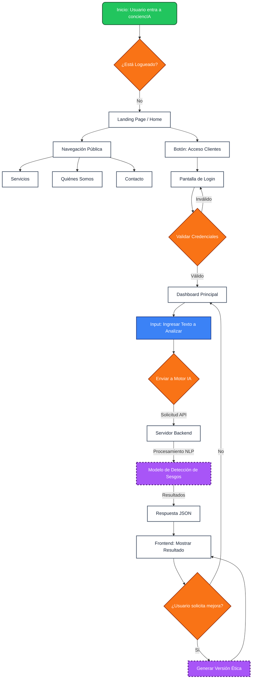

# conciencia
Prototipo de la pagina web de conciencia.

```mermaid
graph TD
    %% --- PALETA DE COLORES (PRESENTABLE) ---
    %% Verde: Inicio
    classDef start fill:#22c55e,stroke:#14532d,stroke-width:2px,color:#fff,rx:10,ry:10;
    %% Azul: Acciones del Usuario (Input)
    classDef user fill:#3b82f6,stroke:#1e3a8a,stroke-width:2px,color:#fff;
    %% Blanco/Gris: Sistema y Pantallas
    classDef system fill:#ffffff,stroke:#475569,stroke-width:2px,color:#1e293b;
    %% Morado: Inteligencia Artificial (El diferenciador)
    classDef ai fill:#a855f7,stroke:#581c87,stroke-width:3px,stroke-dasharray: 5 5,color:#fff;
    %% Naranja: Decisiones lógicas
    classDef decision fill:#f97316,stroke:#9a3412,stroke-width:2px,color:#fff,rhombus;

    %% --- TU DIAGRAMA ORIGINAL ---
    A[Inicio: Usuario entra a conciencIA] --> B{¿Está Logueado?}
    
    %% Flujo Público
    B -- No --> C[Landing Page / Home]
    C --> D[Navegación Pública]
    D --> E[Servicios]
    D --> F[Quiénes Somos]
    D --> G[Contacto]
    C --> H[Botón: Acceso Clientes]
    
    %% Flujo de Autenticación
    H --> I[Pantalla de Login]
    I --> J{Validar Credenciales}
    J -- Inválido --> I
    J -- Válido --> K[Dashboard Principal]
    
    %% Flujo de la Herramienta (Core)
    K --> L[Input: Ingresar Texto a Analizar]
    L --> M{Enviar a Motor IA}
    
    %% Proceso Interno (Backend)
    M -->|Solicitud API| N[Servidor Backend]
    N -->|Procesamiento NLP| O[Modelo de Detección de Sesgos]
    O -->|Resultados| P[Respuesta JSON]
    
    %% Resultado al Usuario
    P --> Q[Frontend: Mostrar Resultado]
    Q --> R{¿Usuario solicita mejora?}
    R -- Sí --> S[Generar Versión Ética]
    S --> Q
    R -- No --> K

    %% --- ASIGNACIÓN DE ESTILOS ---
    class A start
    class L user
    class B,J,M,R decision
    class O,S ai
    %% Todo lo demás es sistema
    class C,D,E,F,G,H,I,K,N,P,Q system
```